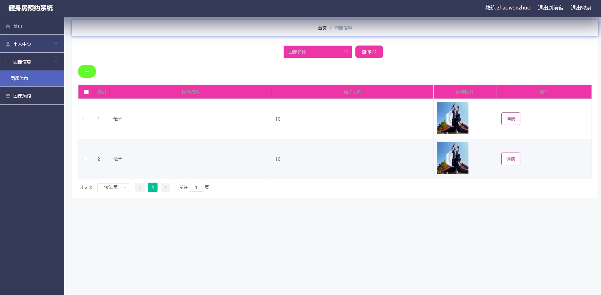
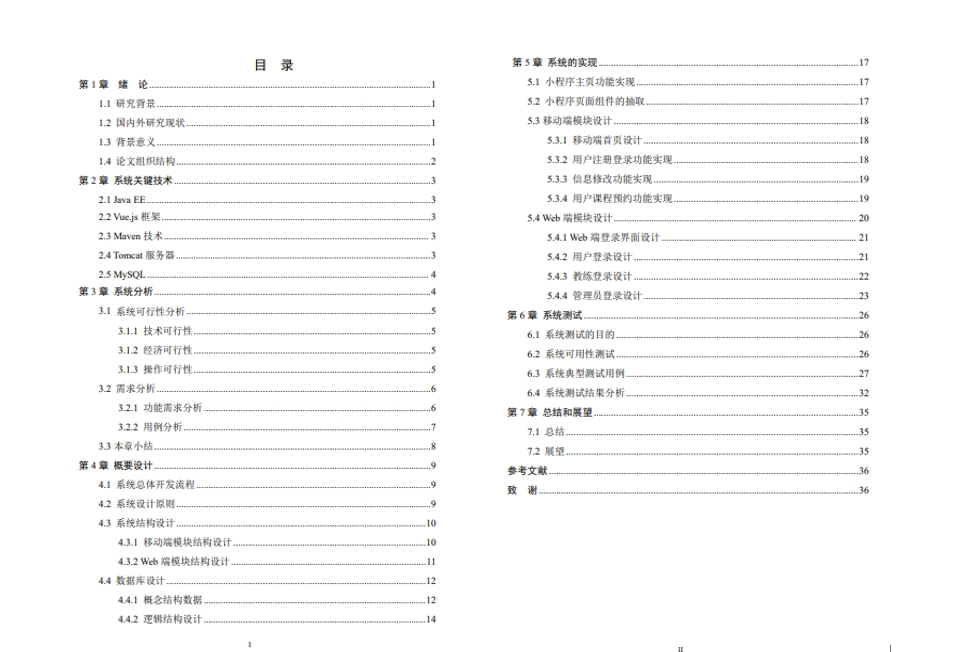

# 1.项目介绍
测试环境：idea2022，MySQL5.7+，Maven3，Tomcat8.5，微信开发工具

技术栈：SSM，Vue，uniapp，MyBatis-plus，Druid，FastJson

项目架构：

# 2.项目部署
## 2.1 后端部署
- 通过Navicat创建数据库，编码为utf8mb4
- 导入sql文件
- 根据本地数据库环境，修改src/main/resources/config.properties的3-5行
- 配置Tomcat，并启动 http://localhost:8080/ssmKPbXZ/admin/dist/index.html（也可以通过vsvode或者webstorm打开后端web项目：src/main/webapp/admin）
- 按照不同角色登录进行配置
## 2.2 小程序部署
- 可以通过HbuilderX打开src/main/webapp/front项目，自定运行到微信小程序
- 也可以直接通过微信开发工具打开mp-weixin项目
- appid选择测试号即可
- 登录测试即可
**注意：项目经过本人本地测试，确保可以正常运行，如果运行有问题，请不要怀疑项目问题！！**

# 3.项目部分截图

# 4.获取方式
[戳我查看](https://gitee.com/aven999/mall)      